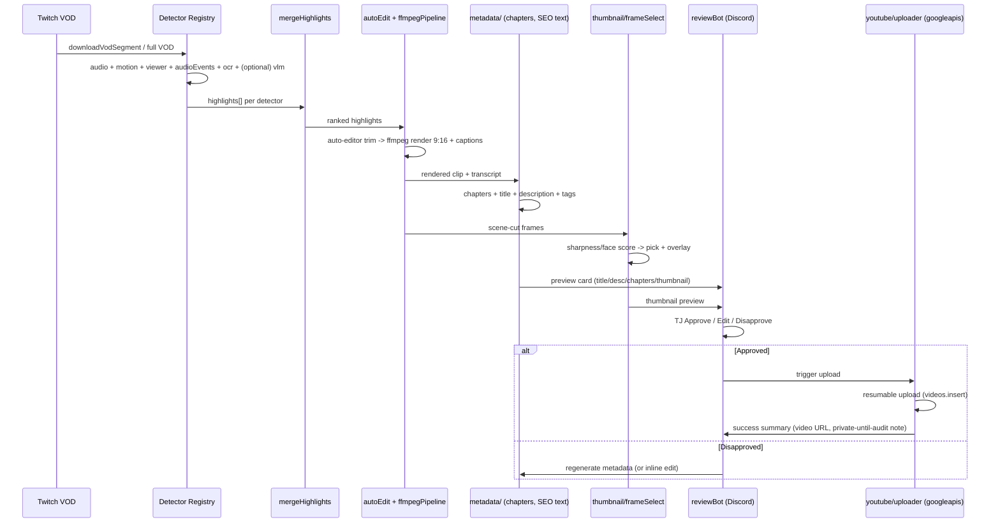

# Vodminer v2 — Phase 2/3: Full YouTube Publishing Pipeline (Architecture Blueprint)

Status: **research + design doc — no code written against this yet.** Constraint
confirmed with TJ 2026-07-06: **100% free/open-source tooling, no paid APIs.**
This is a hard constraint on every tool choice below, not a preference.

---

## 1. Why this doc exists

Vodminer today: Twitch VOD → audio/motion/viewer-clip detectors (registry
pattern, `src/detectors/`) → Twitch Clip via Playwright → optional TikTok
draft. It **never produces a local video file** — Twitch's in-browser clip
editor does all rendering. YouTube's Data API has no share-UI shortcut; it
needs real video bytes. That forces two things Vodminer has never done:
local video *understanding* (what's in this footage, what's worth keeping)
and local video *production* (actually render a file).

The ask that produced this doc went further than raw-VOD-upload (the
original Phase 2 scope in `unfinishedtasks`): full AI-assisted editing,
generated titles/descriptions/chapters/tags/thumbnails. This doc designs
that fuller system, but the roadmap (§9) still recommends landing the
original narrow Phase 2 first and treating everything else as Phase 3+.

---

## 2. Hard constraints carried into every decision

1. **Free/OSS only.** No OpenAI/Gemini/Claude vision calls, no paid image-gen,
   no commercial video-AI SaaS. Every tool below is free-to-run (self-hosted
   or CPU/local-GPU).
2. **Node.js 20+ ES modules, no TypeScript** — the existing stack. New
   Python-only tools are integrated as **spawned child processes**
   (`child_process.spawn`), exactly like today's `ffmpeg`/`yt-dlp` calls —
   not a rewrite, not a second service unless justified (see §5.4).
3. **Detector registry is the existing extension seam.** New signals
   (transcript, OCR, VLM captioning) become new entries in
   `src/detectors/`, not a parallel system. `runDetectors` already handles
   partial failure (`detectorsFailed` → Discord line) — new detectors get
   that for free.
4. **Human approval stays in the loop.** Existing Discord Approve/Disapprove
   pattern is the only human checkpoint mechanism today; extend it, don't
   replace it.

---

## 3. What research ruled out or flagged (see full research, task #2)

- **Gaming highlight/"exciting moment" detection has no mature free
  drop-in model.** This is the single hardest problem in the whole
  extension — see §4.4 and §8.
- **YOLO11/12 is AGPL-3.0** — copyleft. Fine for private/local use; flag
  before any future public distribution. Apache-2.0 fallback: RF-DETR,
  D-FINE.
- **GPU is the real gating constraint**, not tool licensing. VLM video
  understanding and any Stable-Diffusion-class thumbnail generation
  meaningfully want 8–16GB+ VRAM. Everything CPU-only (whisper.cpp,
  tesseract.js, auto-editor, PySceneDetect, ffmpeg scene filter) stays
  fully in budget regardless of hardware.
- **YouTube upload quota changed favorably** (per multiple sources,
  moderate-high confidence, not independently primary-source-verified):
  `videos.insert` reportedly dropped from ~1,600 to ~100 quota units
  (Dec 2025) and may now draw from a separate ~100/day upload bucket
  (June 2026) rather than the shared 10k pool — i.e. roughly **100
  uploads/day** instead of ~6/day. **Verify against
  `developers.google.com/youtube/v3/determine_quota_cost` before
  architecting rate limits around this number** — it's the one figure in
  this doc that couldn't be confirmed against the primary source.

---

## 4. Pipeline stages (end-to-end)

Each stage below states: what it does, which free tool, Node-native vs.
Python-sidecar, and where it plugs into the existing codebase.

### 4.1 Ingest (existing — no change)
`getLatestVod` / `getAllVods` (`src/twitch/vodFetcher.js`) already does this.

### 4.2 Transcript (new)
- **Tool:** `whisper.cpp` (MIT). Compiled binary, spawned via
  `child_process` exactly like `ffmpeg`/`yt-dlp` — **no Python dependency,
  no sidecar**. Use CPU mode by default; GPU (Metal/CUDA/Vulkan build) if
  available.
- **Output:** timestamped transcript (JSON/SRT).
- **Why not faster-whisper:** same model weights/accuracy, but no
  first-class Node story — would force a Python sidecar for zero benefit
  over whisper.cpp's CLI-spawn simplicity.

### 4.3 Scene detection (new)
- **Tool:** ffmpeg's built-in `select='gt(scene,N)'` filter — already the
  exact pattern `motionDetector.js` uses for scene-cut scoring. **Zero new
  dependency.**
- **Escalation path only if recall proves inadequate on gameplay footage:**
  PySceneDetect (BSD-3, Python sidecar).

### 4.4 Highlight scoring (extends existing registry — the hard part)
No single free model does "is this moment highlight-worthy" well. Compose
existing + new signals into one scorer, each a registry entry:
- `audioDetector` (existing, RMS spikes)
- `motionDetector` (existing, scene-cut density)
- `viewerClipDetector` (existing, community-made clips)
- **new:** audio-event tagging via PANNs (`panns-inference`, Python
  sidecar) — laughter/applause/music vs. speech, feeds a "crowd reaction"
  signal RMS alone can't see.
- **new:** OCR-read game-state changes (kill feed, score) via
  `tesseract.js` (WASM, Node-native, zero Python) — a scoring signal
  specific to gameplay VODs.
- **new (GPU-gated, optional):** VLM scene captioning (Qwen2.5-VL via
  Ollama's local HTTP API — Node-native call, no sidecar) for a semantic
  "what's happening" signal on top of the mechanical ones above.
- All of these feed `mergeHighlights` (`src/detectors/merge.js`), which
  already does overlap-dedup, banned-range filtering, cap, and sort —
  **no change needed to the merge algorithm, only new inputs to it.**

This is explicitly the highest-engineering-effort, lowest-certainty stage.
Budget accordingly (§9) — expect iteration on scoring weights, not a
one-shot correct implementation.

### 4.5 Auto-editing (new — YouTube Shorts/edited-VOD path ONLY)
- **Tool:** `auto-editor` (Unlicense, Python CLI) — silence/motionlessness
  cutting with adjustable margins. Spawned via `child_process`, same
  pattern as yt-dlp.
- Runs on the segment `downloadVodSegment` already produces, **before**
  the (currently dead) `src/processing/ffmpegPipeline.js` render step —
  this is the resurrection point `unfinishedtasks` already flagged.
- **Does not apply to the Twitch clip path** (see §4.7.1) — Twitch Clips
  have no local render step to trim.

### 4.6 Rendering (resurrects dead code — YouTube path ONLY)
- `src/processing/ffmpegPipeline.js` (currently unused since the
  Twitch-Playwright pivot) becomes live again for the Shorts path: crop
  9:16, caption overlay (burn in transcript segments from §4.2), encode
  H.264. For raw-VOD→YouTube, no render needed — upload the yt-dlp
  download directly.
- **Does not apply to the Twitch clip path** (see §4.7.1) — same reason
  as §4.5.

### 4.7 Metadata generation (new — shared across BOTH publishing paths)
- **Chapters/description/tags:** YouTube-only (Twitch Clips have no
  description/chapters/tags fields). Transcript (§4.2) → segment
  boundaries via pause-gaps or a local LLM prompt (same Ollama model as
  §4.4, if GPU available; otherwise a pause-gap heuristic) → format as
  YouTube's required `0:00 Chapter Title` lines, first chapter forced to
  `0:00`, minimum 3 chapters ≥10s each. Description generation follows
  the 2026 SEO research (§3): watch-time/retention signals dominate over
  keyword-stuffing now; front-load value in the first 2–3 lines; tags are
  a minor signal, hashtags still help discoverability.
- **Title generation — decided 2026-07-06: shared with the Twitch clip
  path, not YouTube-only.** `metadata/seoText.js` becomes the single
  title-generation module for both platforms, replacing the current
  `buildClipTitle` (game + timestamp template) call sites in
  `src/pipeline.js` (live path) and `scripts/backfill.js`. Same
  transcript-informed generation logic (§4.2 keywords, or local LLM if
  available) feeds both `publishClip`'s `title` param (Twitch) and the
  YouTube upload's `snippet.title`. Deterministic template fallback
  (game name + timestamp + top transcript keyword) if transcript/LLM is
  unavailable — same fallback shape `buildClipTitle` already has, so
  behavior degrades to *exactly today's Twitch title* when the new
  pipeline can't run, not a regression.
- No dedicated free library exists for any of this — it's hand-rolled
  glue code on top of the transcript, same conclusion the research agent
  reached.

#### 4.7.1 Why auto-editing/rendering/thumbnails stay YouTube-only

Twitch Clips are rendered **server-side by Twitch** from their own VOD;
Playwright only selects a `startSec`/`endSec` range on their in-browser
editor and clicks publish (`src/twitch/clipPublisher.js`). There is no
local file to trim (§4.5), nothing to render (§4.6), and no API/UI path
to supply a custom thumbnail (§4.8) — Twitch auto-generates the clip
thumbnail itself. These three stages are structurally YouTube-only; only
**detection** (§4.4, already shared — better boundaries improve the
Twitch clip range too) and **title text** (above) can cross over.

### 4.8 Thumbnail (new — YouTube path ONLY, see §4.7.1)
- **Default:** heuristic frame extraction — sample frames at scene cuts
  (reuse §4.3 output), score by sharpness/contrast + face presence
  (`DeepFace` or `UniFace`, MIT, Python sidecar — pick MIT over the
  AGPL YOLO path per §3), pick top candidate, overlay title text via
  ffmpeg drawtext or a Node canvas lib. **This is the recommended default
  — zero GPU requirement, matches the project's ffmpeg-first philosophy.**
- **Optional upgrade (GPU-gated, off by default):** FLUX.1 schnell
  (Apache-2.0, genuinely free weights) for generated/stylized thumbnails.
  Real GPU commitment (8–12GB VRAM minimum) — treat as an opt-in stretch
  goal, not the baseline.

### 4.9 Human approval (extends existing Discord bot)
- Reuse `reviewBot`'s existing Approve/Disapprove pattern
  (`src/discord/reviewBot.js`). New checkpoint before upload: post the
  generated title/description/chapters/thumbnail as a Discord preview
  card; Approve triggers upload, Disapprove/edit re-runs metadata
  generation or lets TJ hand-edit inline (mirrors the existing
  `askGameName` text-modal pattern for corrections).

### 4.10 Publish (new)
- **Tool:** `googleapis` npm package + `google-auth-library` — the
  standard, officially-documented Node client. Resumable upload via
  `videos.insert` with a stream.
- OAuth setup is the `unfinishedtasks` TJ-only to-do (Google Cloud
  project, YouTube Data API v3, OAuth client, `youtube-login.js` to
  capture a refresh token) — unchanged by this doc, still a prerequisite.
- Chapters go in `snippet.description` as formatted text, not a separate
  field.
- Pre-audit, all uploads are locked to `private` regardless of intent
  (confirmed in `unfinishedtasks`) — unaffected by anything in this doc.

---

## 5. System architecture

### 5.1 High-level shape

```
                         ┌─────────────────────────────┐
                         │   src/detectors/ (registry)  │
                         │  audio | motion | viewer     │
                         │  + NEW: audioEvents (PANNs)  │
                         │  + NEW: ocrEvents (tesseract)│
                         │  + NEW: vlmCaption (Ollama)  │
                         └──────────────┬───────────────┘
                                        │ highlights[]
                                        ▼
                         ┌─────────────────────────────┐
                         │  mergeHighlights (existing,  │
                         │  unchanged algorithm)        │
                         └──────────────┬───────────────┘
                                        │ ranked highlights (better
                                        │ boundaries benefit BOTH paths)
                                        ▼
                         ┌─────────────────────────────┐
                         │  metadata/seoText.js (NEW)   │
                         │  transcript-informed title   │
                         │  generation — SHARED module  │
                         └──────────────┬───────────────┘
                                        │ title
              ┌─────────────────────────┼─────────────────────────┐
              ▼                                                   ▼
   ┌─────────────────────┐                              ┌─────────────────────┐
   │ Twitch Clip path     │                              │ YouTube path (NEW)   │
   │ (title gen NEW,      │                              │                      │
   │  rest unchanged)     │                              │ transcript (whisper) │
   │ Playwright → clip    │                              │ → auto-editor trim   │
   │ → TikTok draft       │                              │ → ffmpegPipeline     │
   └─────────────────────┘                              │   render (resurrect)│
                                                          │ → chapters/desc/tags│
                                                          │ → thumbnail gen      │
                                                          │ → Discord approval   │
                                                          │ → googleapis upload  │
                                                          └─────────────────────┘
```

Both paths share the detector/merge front end AND title generation —
decided 2026-07-06 (§4.7). Auto-editing, rendering, chapters/description/
tags, and thumbnails remain YouTube-only per §4.7.1 (Twitch Clips are
rendered server-side by Twitch; there's no local file to edit and no
custom-thumbnail API). The YouTube path is additive; the Twitch path gets
one new shared dependency (title generation) and is otherwise unchanged.

### 5.2 Node vs. Python sidecar decision

Per the research agent's flagged gap: roughly half the new tools have no
Node-native path. **Decision: no shared long-lived Python service.** Each
Python-only tool is a standalone script, spawned per-invocation via
`child_process.spawn`, identical to the existing `yt-dlp`/`ffmpeg` pattern.
Reasons:
- Matches the project's existing architecture exactly — no new
  operational surface (no service to keep alive, health-check, or
  restart).
- Each tool's Python dependency set is small and independent
  (auto-editor, PANNs, DeepFace/UniFace) — a shared venv risks dependency
  conflicts for no real benefit at this scale.
- If profiling later shows per-invocation Python startup cost is a real
  bottleneck (unlikely at "process one VOD" cadence), revisit as a single
  shared sidecar then — not preemptively.

Node-native tools (whisper.cpp via CLI spawn, tesseract.js, googleapis,
Ollama's HTTP API) need no sidecar at all.

### 5.3 Where this lives in the repo

```
src/
  detectors/
    audioEventDetector.js      (NEW — PANNs sidecar)
    ocrEventDetector.js        (NEW — tesseract.js, in-process)
    vlmCaptionDetector.js      (NEW — Ollama HTTP, in-process)
  processing/
    ffmpegPipeline.js          (RESURRECTED — Shorts render)
    autoEdit.js                (NEW — auto-editor sidecar wrapper)
  transcript/
    whisper.js                 (NEW — whisper.cpp CLI wrapper)
  metadata/
    chapters.js                (NEW — transcript → chapter formatting)
    seoText.js                 (NEW — title/description/tags generation)
  thumbnail/
    frameSelect.js             (NEW — scene-cut + sharpness/face scoring)
  youtube/
    auth.js                    (NEW — OAuth/refresh-token handling)
    uploader.js                (NEW — googleapis resumable upload)
scripts/
  youtube-login.js             (NEW — one-time OAuth capture, per unfinishedtasks)
```

### 5.4 Decision-making logic (what runs when)

- Detector registry: unchanged sequential execution (heavy processes,
  intentionally not parallelized — same reasoning as today's comment in
  `src/detectors/index.js`).
- YouTube path only triggers for VODs where TJ has opted in (config flag
  per-VOD or global `config.js` toggle — mirrors existing `SKIP_TIKTOK_DRAFTS`
  env-var pattern) — **not** automatic for every VOD by default, since
  upload quota (§3) and compute cost are real limits.
- GPU-gated stages (VLM captioning, FLUX thumbnails) check for a
  reachable local Ollama/GPU endpoint at startup and **degrade gracefully
  to the CPU-only path** if unavailable — same shape as today's
  `profileExists()` check gating Twitch-Playwright publishing.

### 5.5 Error handling and fallback strategy

Extends the existing pattern (per-detector try/catch → `detectorsFailed` →
Discord line; VOD-processed marker only written on success):
- Each new pipeline stage (transcript, metadata, thumbnail) wraps in
  try/catch with a **defined fallback**, not a pipeline-killing throw:
  - Transcript fails → skip chapter/caption generation, proceed with
    template-only metadata.
  - Metadata LLM call fails/unavailable → deterministic template fallback
    (already the pattern for `buildClipTitle`).
  - Thumbnail scoring fails → fall back to "first frame at 25% duration,"
    no text overlay.
  - Upload fails → do **not** mark VOD processed for the YouTube path
    (mirrors existing `pipelineError` → "will retry on next trigger"
    behavior in `src/pipeline.js`).
- A new `youtubeError` summary line, same shape as the existing Discord
  failure summary.

### 5.6 Human approval checkpoints

1. **Existing:** game-name confirmation (`askGameName`) — unchanged.
2. **Existing:** per-clip Approve/Disapprove for Twitch/TikTok — unchanged.
3. **New:** pre-upload preview card — title, description, chapters,
   thumbnail, rendered video length — Approve triggers
   `youtube/uploader.js`; Disapprove offers "regenerate metadata" or
   "edit inline" (text modal, same UX as `askGameName`).

### 5.7 Scalability considerations

- Whisper/PANNs/OCR/VLM stages are all **batch, not real-time** — VOD
  processing already happens post-stream, async, with no latency SLA.
  This means CPU-only fallbacks (whisper.cpp, tesseract.js) are
  acceptable even without a GPU; they just take longer per VOD.
- Upload quota (§3, ~100/day if confirmed) is far above this project's
  realistic daily VOD volume (1 stream/day) — not a near-term constraint.
- If GPU stages are added, they become the throughput bottleneck for
  multi-VOD backfills (`scripts/backfill.js` already exists for the
  Twitch path) — process VODs sequentially, not in parallel, same
  reasoning as the existing detector-registry sequencing.

### 5.8 Future expansion opportunities

- Chapter/metadata quality will likely need a feedback loop (TJ's manual
  edits in the approval step become training signal for prompt tuning) —
  out of scope for this doc, flagged for a later loop, same treatment
  Phase 1 gave "feedback/learning loop."
- If a local GPU becomes consistently available, VLM captioning
  (§4.4) upgrades from optional to default — architecture already
  supports this via the graceful-degradation check (§5.4).
- Multi-platform expansion (Instagram Reels, etc.) would reuse the same
  render pipeline (§4.6) with a different publish adapter — the
  detector→merge→render pipeline is already platform-agnostic; only
  `youtube/uploader.js`-equivalent modules are platform-specific.

---

## 6. Sequence diagram (Shorts → YouTube path, happy path)



---

## 7. Tool selection summary (justification table)

| Stage | Tool | License | Node-native? | GPU needed? |
|---|---|---|---|---|
| Transcript | whisper.cpp | MIT | Yes (CLI spawn) | No (optional) |
| Scene detection | ffmpeg `select=gt(scene,N)` | existing dep | Yes | No |
| Highlight scoring (audio events) | PANNs (panns-inference) | Apache-adjacent | No (Python sidecar) | No |
| Highlight scoring (OCR) | tesseract.js | Apache 2.0 | Yes | No |
| Highlight scoring (VLM, optional) | Qwen2.5-VL via Ollama | Apache 2.0 | Yes (HTTP call) | Yes, 8GB+ |
| Auto-editing | auto-editor | Unlicense | No (Python sidecar) | No |
| Face detection (for thumbnails) | DeepFace or UniFace | MIT | No (Python sidecar) | No |
| Thumbnail (upgrade path) | FLUX.1 schnell | Apache 2.0 | No (Python sidecar) | Yes, 8-12GB+ |
| Metadata/chapters | hand-rolled + optional local LLM (Ollama) | n/a | Yes | Optional |
| Publish | googleapis + google-auth-library | Apache 2.0 | Yes | No |

Everything in the **default/recommended path is Node-native or a
lightweight CPU-only Python spawn** — the GPU-gated rows are explicitly
optional upgrades, not requirements to ship.

---

## 8. Biggest open risks (carried from research, not resolved by this doc)

1. **Highlight scoring quality is unproven.** Composing RMS + motion +
   audio-events + OCR + optional VLM into one scorer is genuine new
   engineering, not integration — expect a tuning loop against real VODs,
   the same way `detector.motion.sceneThreshold` already needs live-VOD
   tuning per `unfinishedtasks`.
2. **YOLO AGPL-3.0** — avoided by default (using DeepFace/UniFace instead
   for face detection), but flag if a future need for general
   object-detection (not just faces) arises and AGPL becomes relevant.
3. **Upload quota figure unverified against primary source** — confirm
   before relying on "~100 uploads/day" for any rate-limiting logic.
4. **GPU availability on TJ's actual hardware is unknown to this doc** —
   every GPU-gated stage must be genuinely optional (§5.4's graceful
   degradation), not assumed.

---

## 9. Implementation roadmap (MVP → production)

Recommendation: **do not build this as one loop.** Land in the order
below; each phase is independently shippable and independently
verifiable (tjloop-style, matching how Phase 1 shipped).

### Phase 2a — MVP: raw VOD → unlisted YouTube (no AI editing)
- `youtube/auth.js` + `youtube/uploader.js` + `scripts/youtube-login.js`.
- Upload the yt-dlp-downloaded full VOD as-is, `private` visibility
  (pre-audit constraint), title = existing game-aware title pattern,
  description = VOD date/game only (no AI generation yet).
- This is the **already-scoped, blocked-on-TJ's-OAuth-setup** Phase 2 from
  `unfinishedtasks` — ship it first, independent of everything else in
  this doc.

### Phase 2b — Transcript + basic metadata
- `transcript/whisper.js`.
- `metadata/chapters.js` (pause-gap heuristic, no LLM dependency yet).
- `metadata/seoText.js` (template-driven, no LLM dependency yet).
- Adds real chapters/description to the Phase 2a upload — still no video
  editing.

### Phase 3a — Shorts path: auto-edit + render
- Resurrect `src/processing/ffmpegPipeline.js`.
- `processing/autoEdit.js` (auto-editor wrapper).
- Reuses Phase 2b's transcript for burned-in captions.
- New Discord approval checkpoint (§4.9/§5.6) before upload.

### Phase 3b — Enhanced highlight scoring
- `detectors/audioEventDetector.js` (PANNs).
- `detectors/ocrEventDetector.js` (tesseract.js).
- Tune against real VODs — treat as its own loop with a DA-style
  adversarial review of scoring quality, same rigor Phase 1 applied to
  the motion detector's central-risk benchmark.

### Phase 3c — Thumbnail generation
- `thumbnail/frameSelect.js` (heuristic default).
- FLUX.1 upgrade path only if GPU confirmed available and TJ wants it —
  explicitly optional, last in the roadmap since it has the highest
  hardware bar for the least functional necessity.

### Phase 4 (future, not scoped here)
- Optional local-LLM-driven metadata generation (upgrade from templates,
  gated on Ollama availability).
- Optional VLM highlight captioning.
- Feedback loop from TJ's manual edits → scoring/prompt tuning.
- Multi-platform publish adapters (Reels, etc.).

---

## 10. What this doc deliberately does not do

No code has been written against this doc. Per TJ's explicit scope choice
(2026-07-06): research + architecture only. Phase 2a is ready to start as
its own implementation loop once TJ confirms this blueprint and completes
the YouTube OAuth setup already listed as a to-do in `unfinishedtasks`.
